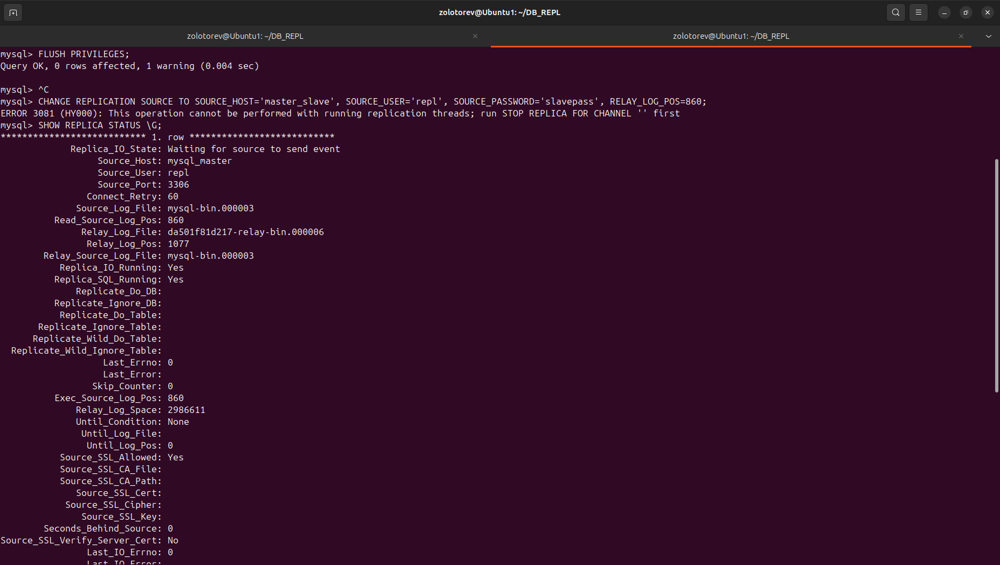
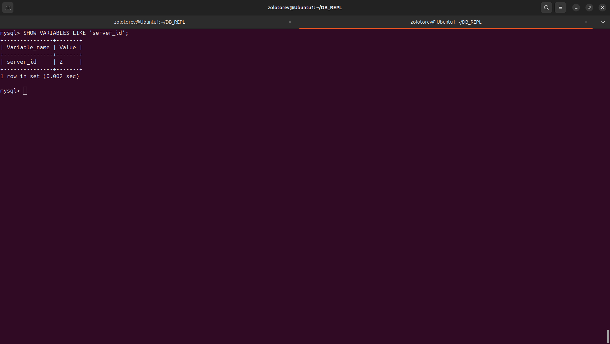
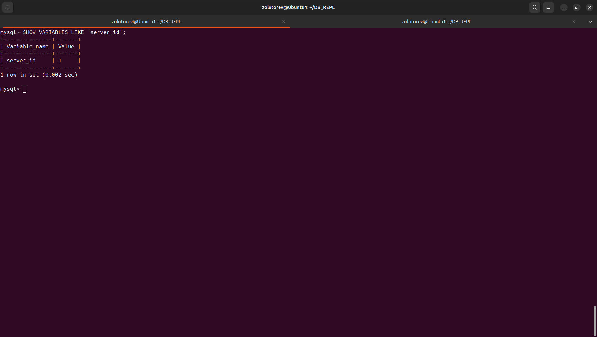

Домашнее задание к занятию «Репликация и масштабирование. Часть 1»
### Золоторев Н.Д.

### Задание 1

На лекции рассматривались режимы репликации master-slave, master-master, опишите их различия.

Ответить в свободной форме.

### Решение 1

Master-Slave

    Master — единственный сервер, который принимает запись и изменения.

    Slave копирует данные с Master и работает только на чтение.

    При выходе Master из строя запись данных становится невозможна без ручного переключения.

Master-Master

    Оба сервера принимают запись и изменения.

    Каждый сервер синхронизирует изменения с другим как с равным.

    Клиенты могут читать и писать на любом сервере.

    Режим рискованный: при одновременной записи в одно место на разных серверах возникают конфликты, которые могут разрушить целостность данных.

### Задание 2

Выполните конфигурацию master-slave репликации, примером можно пользоваться из лекции.

Приложите скриншоты конфигурации, выполнения работы: состояния и режимы работы серверов.

### Решение 2

